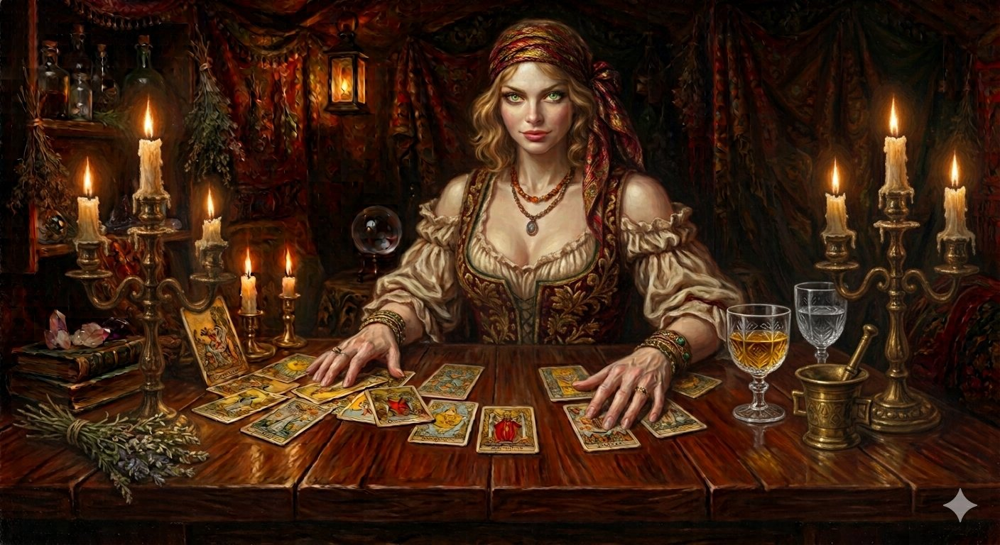

# A Tenda de Zaira



Uma leitura de Tarô em 3D. Você entra numa tenda à luz de velas, senta-se diante da cartomante **Zaira** e ela lê as cartas para você na **Cruz Celta**: embaralha até você mandar parar, abre o baralho para você cortar, distribui as dez cartas e vira uma a uma, contando o que cada uma significa.

A Zaira é a do retrato acima: cabelos cor de mel, olhos verdes, lenço vermelho e dourado, blusa branca franzida, corpete bordô bordado, colar de âmbar e pulseiras. A tenda também segue o retrato: mesa de madeira, candelabros de três velas, bola de cristal, taças, pilão de latão, lavanda, livros com cristais, lanterna e prateleira de frascos.

**Acesse (versão de desenvolvimento):** https://danramon786.github.io/tenda-de-zaira-dev/

**Versão estável, divulgada:** https://danramon786.github.io/tenda-de-zaira/

## Como conversar com a Zaira

| Momento | Pela voz (microfone) | Pela câmera | Pelo toque |
|---|---|---|---|
| Aceitar a leitura | "sim", "quero", "pode" | acenar com a cabeça | botão |
| Dizer o nome | "meu nome é Dan" | — | digitar |
| Parar de embaralhar | "pare", "chega", "pronto" | — | botão |
| Cortar o baralho | "corte na trinta e dois", "aqui" | — | tocar no leque, setas ◀ ▶ |
| Próxima carta | "próxima", "continue" | acenar com a cabeça | botão |
| No final | "nova consulta", "rever", "finalizar" | — | botões |

A câmera também faz a Zaira perceber quando você se senta, acompanhar o seu rosto com o olhar (a cena se move levemente com a sua cabeça, como uma janela) e reagir a um sorriso.

**Privacidade:** a imagem da câmera é analisada só no seu aparelho, pelo MediaPipe, e nada é enviado. O reconhecimento de fala é o do próprio navegador.

**Navegadores:** Chrome e Edge (computador e Android) fazem tudo. No Safari do iPhone, a voz funciona quando o Siri está ativado. No Firefox não há reconhecimento de fala, então use os botões. Microfone e câmera só funcionam em endereço `https://`, como o do GitHub Pages.

## O sorteio

As cartas saem pelo **sorteio v2** da Tenda, o mesmo algoritmo do `TAROTSRT.BAS`:

- O gerador de números é o do TAROT.EXE de 1986 (runtime BASCOM 5.60).
- A semente combina as 3 primeiras letras do nome com o relógio em centésimos de segundo.
- O baralho é embaralhado de verdade até você mandar parar, e o corte acontece no ponto que você escolher.
- As inversões seguem a regra do programa original.

Em **Rever**, a página mostra o comando `tarotsrt V2 …` que reproduz a mesma tiragem no BASIC.

Os textos das 78 cartas e das dez posições vêm do programa **TAROT** (R. K. West, 1986), recuperado por engenharia reversa e traduzido por Dan Ramon Ribeiro.

## A Zaira em 3D, hoje e depois

O modelo 3D atual parte da amostra VRM da pixiv, repintada pela ferramenta `ferramentas/repinta.py`: cabelo mel, olhos verdes, blusa branca e corpete bordado. O lenço, o colar, as pulseiras, a saia longa e a cadeira são modelados no código, em `js/zaira.js` e `js/cena.js`. O estilo continua o de anime do VRoid, mais simples que a pintura.

Para uma Zaira mais fiel ao retrato, crie a personagem no VRoid Studio seguindo o retrato: cabelo longo ondulado cor de mel, olhos verdes, blusa de ombros caídos com mangas bufantes, corpete e saia longa. Os acessórios de `js/zaira.js` continuam funcionando com qualquer modelo; apague-os se o seu já tiver lenço e joias.

Para usar uma personagem sua:

1. Baixe o **VRoid Studio** (gratuito): https://vroid.com/en/studio
2. Crie a personagem: cabelo, rosto, roupas (um lenço, uma saia longa, brincos...).
3. Exporte como **VRM** (versão 1.0 ou 0.x, as duas funcionam).
4. No GitHub, substitua o arquivo `modelo/zaira.vrm` pelo seu, com o mesmo nome.

O programa ajusta a altura, senta a personagem à mesa e move braços, olhos e boca sozinho. As cores do figurino são reforçadas em `js/zaira.js` (lista `FIGURINO`); apague essa lista se quiser as cores originais do seu modelo.

## Arquivos

```
index.html          página, estilos e textos da entrada
js/main.js          o Maestro: a consulta passo a passo
js/cena.js          tenda, mesa, velas, bola de cristal, fumaça, câmera
js/zaira.js         a Zaira: pose sentada, mãos (cinemática inversa), olhar, piscar, boca
js/cartas.js        cartas 3D, baralho, leque do corte, imagens do Commons
js/voz.js           fala (síntese) e escuta (reconhecimento) em português
js/olhos.js         webcam: presença, olhar, sorriso, aceno
js/motor.js         sorteio v2 (igual ao TAROTSRT.BAS)
js/textos.js        falas da Zaira
img/zaira.jpg       o retrato da Zaira (tela de entrada)
ferramentas/        repinta.py: como o modelo de amostra virou a Zaira
data/cartas.json    as 78 cartas em português
modelo/zaira.vrm    a personagem 3D
lib/                Three.js, three-vrm e MediaPipe (cópias locais)
```

Não há etapa de compilação: é um site estático. Para testar no computador, sirva a pasta com qualquer servidor local (por exemplo `python -m http.server`) e abra `http://localhost:8000`.

## Créditos e licenças

- **Cartas**: baralho Rider-Waite-Smith, ilustrado por Pamela Colman Smith (1909), em domínio público. As imagens são carregadas do [Wikimedia Commons](https://commons.wikimedia.org/wiki/Category:Rider-Waite_tarot_deck). Se não carregarem, a carta aparece desenhada com o nome e o naipe.
- **Textos**: programa TAROT © 1986 R. K. West; tradução e revisão de Dan Ramon Ribeiro.
- **Retrato da Zaira** (`img/zaira.jpg`): Dan Ramon Ribeiro.
- **Modelo 3D**: a partir de `VRM1_Constraint_Twist_Sample` © 2022 pixiv Inc., repintado. A [licença VRM 1.0](https://vrm.dev/licenses/1.0/) permite uso, modificação e redistribuição, sem crédito obrigatório.
- **Three.js** (MIT), **three-vrm** (MIT, pixiv) e **MediaPipe Tasks Vision** (Apache 2.0, Google). As licenças estão em `lib/`.
- O modelo de rosto do MediaPipe (`face_landmarker.task`) é baixado do servidor do Google na primeira vez que a câmera é ligada. Se você colocar uma cópia em `modelo/face_landmarker.task`, o site usa a cópia local.
